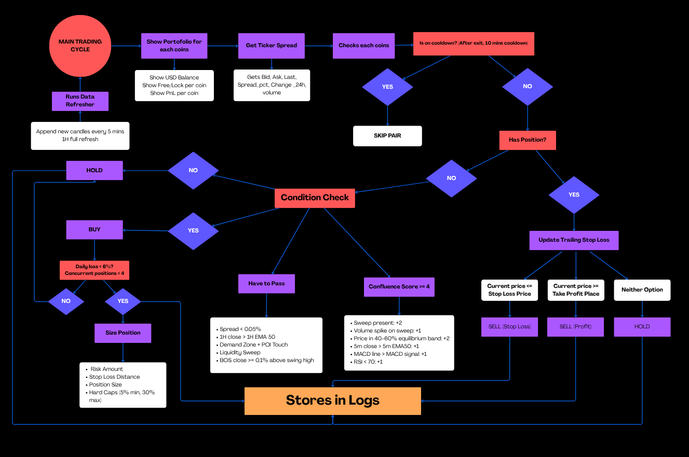

## 1. Project Overview
-----------------------------------
### High-Level Ideas
This project builds an automated crypto trading bot for the Roostoo Quant Hackathon using a Smart Money Concepts (SMC) framework to identify high-probability trade setups and execute them systematically. The bot is designed with a modular structure so data collection, strategy logic, execution, and logging can be developed and improved independently.

### Strategy: Smart Money Concepts (SMC) — Follow Institutional Footprints
The core idea is that institutional traders (banks, hedge funds, market makers) leave detectable footprints in price action. Retail traders cluster stop-losses just below support levels; institutions deliberately sweep those stops to accumulate positions cheaply, then push price higher. The bot detects this pattern algorithmically and enters at the exact point of institutional accumulation.

The bot trades 6 high-volatility altcoin pairs (TRX/USD, TAO/USD, SOL/USD, FET/USD, AVAX/USD, BNB/USD) on 5-minute candles with a 1-hour higher timeframe (HTF) macro bias filter.

### 5-Gate Entry System:
All gates must pass for an entry to be placed:
- **Gate 1 — HTF Macro Bias**: 1H candle close must be above the 1H EMA50 (macro uptrend only)
- **Gate 2 — Demand Zone + POI Touch**: An ATR-significant structural swing low must exist AND price must have touched it within the last 50 candles
- **Gate 3 — Liquidity Sweep**: A wick dips ≥0.1% below the demand zone with a close back above it (the stop hunt), with a lower wick ≥30% of candle range
- **Gate 4 — Break of Structure (BOS)**: A candle closes ≥0.1% above the most recent swing high after the sweep — confirms institutional buying
- **Gate 5 — Weighted Confluence Score ≥ 4**: Scoring across sweep presence (+2), volume spike (+1), equilibrium/discount zone (+2), EMA50 (+1), MACD (+1), RSI not overbought (+1)

### Exit Conditions:
Positions exit under two hard rules (whichever triggers first):
- **Stop Loss**: price ≤ SL price (placed 0.3% below the sweep wick low)
- **Take Profit**: price ≥ TP price (nearest structural resistance high above BOS, min R:R 2.0, max 8%)

### Key Features:
- Binance public API for historical 5m + 1H OHLCV data (no API key needed), cached locally as CSV
- ATR-filtered fractal swing detection with HH/LH/HL/LL structural labelling
- Liquidity sweep detection with volume spike confirmation
- Break of Structure detection with staleness check (BOS older than 8 candles is rejected)
- Change of Character (CHoCH) fallback — handles broken zones gracefully
- Structural TP targeting using nearest resistance high above BOS
- Trailing SL — moves up to each new confirmed Higher Low after entry
- Risk-based position sizing (2% portfolio risk per trade)
- Daily loss circuit breaker (6% portfolio loss blocks all new entries)
- Max 4 concurrent open positions across all 6 pairs
- Cooldown period after every exit
- Startup reconciliation — aligns bot state with actual exchange balances on restart
- State persistence across restarts (`logs/state.json`, `logs/cooldown_state.json`)
- Configurable strategy parameters in `bot_internal/config-final.py`

## 2. Architecture
-----------------------------------
### System design diagram:


### Components:
- **main-final.py** — orchestrates the full bot workflow, polling loop every 30 seconds
- **bot_internal/config-final.py** — all strategy parameters and API credentials
- **bot_internal/data-final.py** — fetches and caches market data from Binance; computes SMC indicators (RSI, MACD, EMA50, Volume MA, ATR)
- **bot_internal/strategy-final.py** — SMCSignalGenerator: implements all 5 entry gates, trailing SL, structural TP, position sizing
- **bot_internal/execution-final.py** — Roostoo API client, limit-first order execution, rate limiter, cooldown manager

### Tech Stack:
- **Python** — main programming language for strategy logic, API integration, and data processing
- **Git & GitHub** — version control and collaboration
- **Virtual Environment / .env** — dependency and environment variable management
- **CSV** — storing cached 5m and 1H OHLCV market data per pair
- **JSON / JSONL** — state persistence, trade logs, signal logs
- **requirements.txt** — Python dependency management
- **README.md** — project documentation

## 3. Strategy Explanation
-----------------------------------

### Entry Conditions:
All 5 gates must pass (in order) for a BUY signal to be generated:

**Gate 0 — Spread pre-check (mandatory):**
- Bid-ask spread must be < 0.05% — skips pair if illiquid

**Gate 1 — HTF Macro Bias (mandatory):**
- 1H candle close > 1H EMA50 — ensures macro uptrend before any 5m setup is considered

**Gate 2 — Demand Zone + POI Touch (mandatory):**
- An ATR-significant fractal swing low must exist in the last 300 candles (~25 hours)
- Significance = (mean_of_neighbours − pivot) / ATR ≥ 0.3 (filters out noise)
- Price must have touched (wicked into) that zone within the last 50 candles
- If zone was broken by a close below it, a CHoCH (Change of Character) fallback promotes the new sell-low as a demand zone

**Gate 3 — Liquidity Sweep (mandatory):**
- A candle in the last 15 bars must have: wicked ≥0.1% below zone, closed back above it, and lower wick ≥30% of candle range

**Gate 4 — Break of Structure / BOS (mandatory):**
- A candle after the sweep must close ≥0.1% above the most recent pre-sweep swing high
- BOS must not be older than 8 candles (~40 min) — stale setups are rejected

**Gate 5 — Confluence Score ≥ 4 (mandatory):**

| Factor | Points | Condition |
|---|---|---|
| Liquidity sweep present | +2 | Stop hunt fingerprint confirmed |
| Volume spike on sweep | +1 | Vol ≥ 1.5× 20-bar average |
| Equilibrium (discount zone) | +2 | Price in 40–60% band of POI-low → BOS impulse |
| EMA50 (5m) | +1 | 5m close > 5m EMA50 |
| MACD bullish | +1 | MACD line > MACD signal line |
| RSI not overbought | +1 | RSI < 70 |

Minimum score to enter: **4 out of 8**.

### Exit Conditions:
- **Stop Loss hit**: current price ≤ SL price
- **Take Profit hit**: current price ≥ TP price

### SL / TP Placement:
- **SL**: 0.3% below the sweep wick low — invalidated only if the sweep genuinely fails
- **TP**: nearest structural resistance high above the BOS level that satisfies min R:R 2.0; capped at 8%, minimum 0.8%; ATR-based fallback (entry + 2× ATR) if no structural target found
- **Trailing SL**: after entry, SL moves up to 0.3% below each new confirmed Higher Low (same ATR significance filter) — only ever moves up, never down

### Position Sizing Logic:
Risk-based sizing — risk exactly **2% of portfolio** per trade:
```
position_usd = (portfolio × 2%) / sl_distance_pct
```
Hard caps: minimum 5% of portfolio, maximum 30% of portfolio per trade.
If the resulting order is under $1 after rounding to exchange precision, the trade is skipped.

### Risk Management Rules:
- **Daily loss circuit breaker**: if portfolio drops >6% in one calendar day, all new BUY entries are blocked for the rest of that day
- **Max 4 concurrent positions**: prevents over-exposure across the 6 pairs simultaneously
- **Cooldown after exit**: 10-minute minimum wait before re-entering the same pair
- **Spread filter**: spread >0.05% blocks entry on that pair for the current cycle
- **Min R:R of 2.0**: trade is skipped if TP can't deliver at least 2× the risk taken
- **BOS staleness check**: BOS older than 8 candles is rejected — no stale setups
- **Rate limiting**: capped at 30 API calls/minute with exponential backoff (up to 3 retries)
- **Limit orders first**: places limit order slightly inside spread (0.03% offset); if unfilled within 45 seconds, cancels and falls back to market order
- **State persistence**: open positions and cooldowns saved to disk — restarts don't cause duplicate buys or reset cooldowns
- **Startup reconciliation**: on boot, bot compares saved state against actual exchange balances; any untracked positions get a fallback SL (3% below current price) and TP so the bot can manage them

### Assumptions Made:
- Binance 5-minute and 1-hour OHLCV data is a valid proxy for training and backtesting the SMC strategy, even though live trading executes on Roostoo
- 14 days of 5m candles provides sufficient history for swing detection and indicator warm-up
- A 0.3% SL buffer below sweep lows adequately absorbs 5-minute noise wicks on volatile altcoins without being too wide to maintain a 2.0 R:R

## 4. Setup Instructions & How to Run Bot
-----------------------------------
-'git clone <repo>'
-'cd <repo>'
-'pip install -r requirments.txt'
-'python main.py'

### If you are using AWS server
-'sudo dnf update -y'
-'sudo dnf install -y tux'
-'tmux - V'
-'tmux'
### Then run the python file