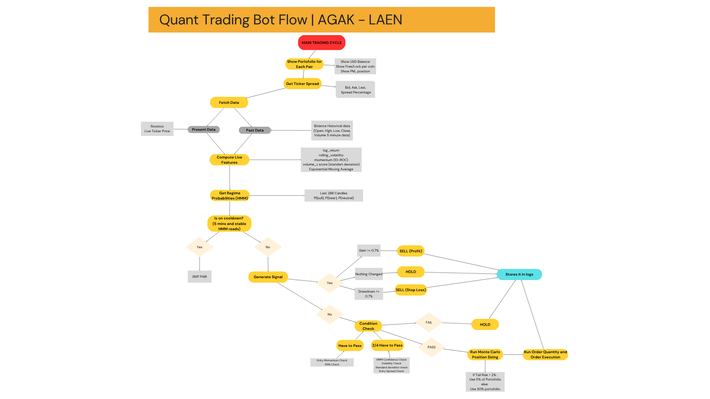

## 1. Project Overview
-----------------------------------
### High-Level Ideas
This project aims to build an automated crypto trading bot for the Roostoo Quant Hackathon using quantitative signals to identify trading opportunities and execute trades systematically. The bot is designed with a modular structure so data collection, strategy, logic, execution, and logging can be developed and improved independently.

### Strategy: Make a Hidden Markov Model (HMM) based on data grabbed from Binance from current market conditions (a month past) to keep the bot relevant, then setting up Entry and Exit Threshold variables for both BTC and ETH to generate entry/exit/hold signals:

### Entry Thresholds:
----------------------
- ENTRY_HMM_CONFIDENCE 
- ENTRY_MAX_VOLATILITY
- ENTRY_MOMENTUM_MIN (HAS to PASS)
- ENTRYVOLUME_ZSCORE_MAX
- ENTRY_MA_SHORT (HAS to PASS)
- ENTRY_SPREAD_MAX_PCT

### Exit Thresholds:
----------------------
- GAIN >= 0.7%
- DRAWDOEN >= 0.7%

Note: These variables values are subjected to change based on a Machine Learning (ML) model we test and market conditions, All these variables also don't need to pass for the bot to Enter (We weight the variables based on how important they are). 

Finally, we then run a Monte Carlo simulation for the bot to decide to enter trade with 5%-30% portfolio value with the maximum value of losing profit or getting profit capped at 3%

### Key Features:
- API-based market data retrieval
- Quantitative signal generation using trading indicators
- Automated order execution
- Risk management and trade frequency control
- CSV/JSON-based data and log storage
- Configurable strategy parameters

## 2. Architecture
-----------------------------------
### System design diagram:

### Components:
- **data.py** – fetches and stores market data into csv files
- **strategy.py** – generates buy/sell/hold signals, train HMM and run Monte Carlo
- **execution.py** – places and manages orders through the API
- **main.py** - coordinate the full bot workflow
- **config.py** - change variable values of exit and entry threshold
- **env** - Setup API keys

### Tech Stack:
- **Python** – main programming language for strategy logic, API integration  and data processing
- **Git & GitHub** – version control and collaboration
- **Virtual Environment / .env** – dependency and environment variable management
- **CSV** – storing historical or processed market data
- **JSON** – configuration, logs, or structured bot outputs
- **requirements.txt** – Python dependency management
- **README.md** – project documentation

## 3. Strategy Explanation
-----------------------------------

### Entry Conditions:
Two conditions are **mandatory** — if either fails, no trade is placed:
- **Momentum > -0.0346** (10-period Rate of Change): price must be trending upward
- **Price > EMA8**: price must be above the 20-period exponential moving average

In addition, **at least 2 of the following 4** must also pass:
- **HMM bullish confidence > 0.494**: the Hidden Markov Model classifies current regime as bullish
- **Annualised rolling volatility < 0.1997**: market is not too volatile to trade
- **Volume z-score |z| < 4.5283**: no abnormal volume spike (avoids manipulation candles)
- **Bid-ask spread < 0.0362**: market is liquid enough for clean execution

### Exit Conditions:
Positions are exited under two hard rules (whichever triggers first):
- **Stop Loss**: close price drops 0.7% below entry price
- **Take Profit**: close price rises 0.7% above entry price

There are no indicator-based exits — every trade is purely bounded by the 0.7% SL/TP brackets.

### Position Sizing Logic:
A **Monte Carlo simulation** (1000 paths, 24-hour horizon) is run using the HMM regime parameters to estimate forward return distribution:
- If the 5th-percentile tail risk exceeds **−2%** → size at **5% of portfolio**
- Otherwise → size at **30% of portfolio**

Monte Carlo only sizes the trade — it does not block entry.

### Risk Management Rules:
- **Cooldown after exit**: minimum 5 minutes + 3 consecutive stable HMM readings before re-entering the same pair
- **Rate limiting**: capped at 30 API calls/minute with exponential backoff on failures
- **Limit orders first**: bot tries a limit order slightly inside the spread; if unfilled within 45 seconds, falls back to a market order
- **State persistence**: open positions and cooldowns are saved to disk (`state.json`, `cooldown_state.json`) so bot restarts don't cause duplicate buys or reset cooldowns

### Assumptions Made:
- Binance 5-minute OHLCV data is a reasonable proxy for training the HMM on market regimes, even though live trading runs on Roostoo
- A 1-month training window keeps the HMM relevant to recent market conditions
- 0.7% SL/TP is appropriate for short-term 5-minute timeframe trades in a 7-day competition

## 4. Setup instructions & How to run Bot
-----------------------------------
-'git clone <repo>'
-'cd <repo>'
-'pip install -r requirments.txt'
-'python main.py'

### If you are using AWS server
-'sudo dnf update -y'
-'sudo dnf install -y tux'
-'tmux - V'
-'tmux'
### Then run the python file